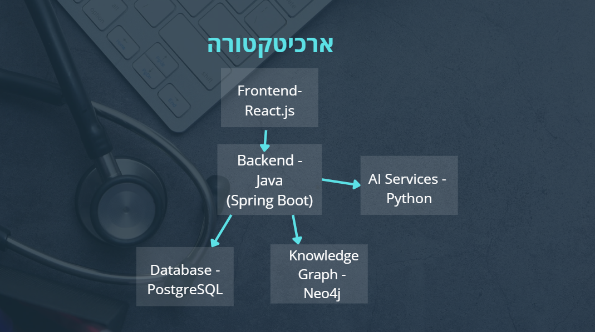

# MediAid – Real-Time AI-Based Medical Decision Support System

MediAid is an intelligent medical recommendation system that provides **real-time guidance** in emergency situations. It combines advanced **NLP**, **Computer Vision**, and a **medical knowledge graph** to generate tailored recommendations based on a user's medical history and live input (free-text or image).

## 🚀 Key Features

- 🧠 **Symptom Extraction** from free text using NLP (MedCAT)
- 👁️ **Image-based Symptom Analysis** using BioMedCLIP (rash/wound detection)
- 🩺 **UMLS Normalization** of symptoms and medical terms
- 🔗 **Personalized Decision Pathways** via Neo4j graph traversal
- 💊 **Integrated Medical History**, risk factors, and medication data
- 📈 **Real-time Recommendations** (e.g., medical exams, treatments, physician referral)

## 🧩 System Architecture




## 🛠️ Tech Stack

| Layer             | Technology                              |
|------------------|------------------------------------------|
| Backend          | Java (Spring Boot), RESTful APIs        |
| AI Services      | Python, MedCAT, BioMedCLIP, scikit-learn|
| Database         | Neo4j (Graph DB), PostgreSQL             |
| Frontend         | React                                    |
| Medical Ontology | UMLS                                     |

## 🧬 AI Modules

- **MedCAT**: Context-aware medical NER + linking to UMLS
- **BioMedCLIP**: Vision-language model trained on biomedical image-text pairs
- **Custom CV/NLP Pipelines**: For multimodal symptom extraction

## 🧪 Use Case Example

1. User uploads a photo of a rash and enters symptoms like “shortness of breath.”
2. The system extracts normalized UMLS symptoms.
3. It cross-references the user’s profile (e.g., asthma, smoking).
4. A path is calculated in the Neo4j graph:  
   `User → Symptoms → Possible Conditions → Recommended Action`
5. The system suggests: _"Contact a physician within 24 hours; potential exacerbation of chronic condition."_

## 📁 Project Structure (Simplified)

```
MediAid/
├── backend/ (Java Spring Boot)
│   ├── controllers/
│   ├── services/
│   └── models/
├── ai-services/ (Python)
│   ├── nlp/
│   ├── vision/
│   └── integration/
├── frontend/ (React)
├── db/
│   ├── neo4j/
│   └── postgres/
└── README.md
```

## 📦 Installation

Clone the repository:

```bash
git clone https://github.com/yourusername/MediAid.git
cd MediAid
```

### Backend

```bash
cd backend
./mvnw spring-boot:run
```

### AI Services

```bash
cd ai-services
python -m venv venv
source venv/bin/activate
pip install -r requirements.txt
python main.py
```

### Frontend

```bash
cd frontend
npm install
npm start
```

## 🧠 Future Enhancements

- 🗣️ Multilingual support (Hebrew, Arabic)
- 📲 Mobile app version
- 🔍 Explainable AI layer for medical decisions
- 🔐 Full FHIR-compliant data handling & user authentication

## 🎥 Project Presentation

Watch the full presentation on [Canva]([https://your-canva-link.com](https://www.canva.com/design/DAGpfz5lEMA/Z1zQLtnfc5McnIhCCKUQig/edit?utm_content=DAGpfz5lEMA&utm_campaign=designshare&utm_medium=link2&utm_source=sharebutton))

> ⚠️ **Disclaimer**: MediAid is a research/development prototype and not intended for actual clinical use without regulatory approval.
